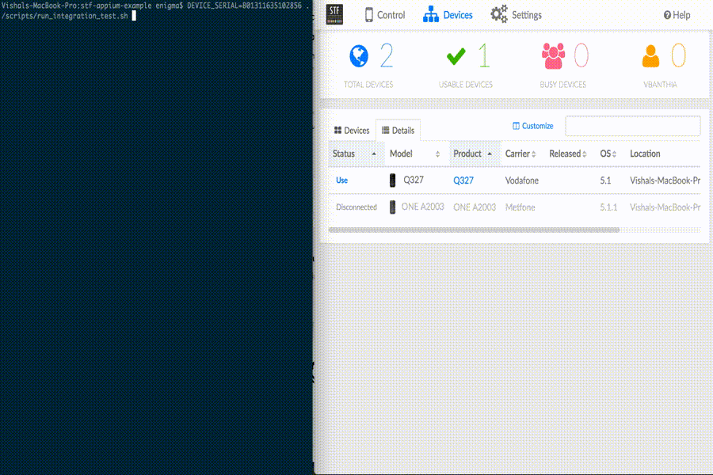

# STF Appium Example



In this tutorial, I am going to explain how to integrate [Appium](http://appium.io/) automated test to OpenSTF device using its [REST API](). Theoretically, it is possible to run automated test of any tool on OpenSTF device. The reason for choosing Appium here is because it is one of the most widely used mobile automated testing tool.

# Prerequisites
- Your device farm is ready and you are using v2.0 or above.
- You have read [OpenSTF API Doc]().
- You know about [Appium](http://appium.io/) and its usages.

# Dependencies
- [NodeJS](https://nodejs.org/en/)
- [Ruby](https://www.ruby-lang.org/en/) > v2.2

# Installation
1. Git clone

  ```bash
  git clone git@github.com:openstf/stf-appium-example.git
  ```

2. Install appium & other node dependencies

  ```bash
  npm install
  ```
  **Note** You will also need to install all the [Appium Dependencies for Android](https://github.com/appium/appium#android-requirements)

3. Install ruby dependencies

  ```bash
  bundle install --path=bundler/vendor

  ## In case bundler is not installed, installed it using below command
  gem install bundler
  ```

# Running example tests
1. Update `SWAGGER_URL` in [stf_connect.js](scripts/stf_connect.js) & [stf_disconnect.js](scripts/stf_disconnect.js) with your domain.
2. Create a new Access Token from Settings > Keys > Access Tokens and update [stf_connect.js](scripts/stf_connect.js) & [stf_disconnect.js](scripts/stf_disconnect.js)
3. Run below command

  ```bash
  DEVICE_SERIAL=YOUR_DEVICE_SERIAL ./scripts/run_integration_test.sh
  ```
